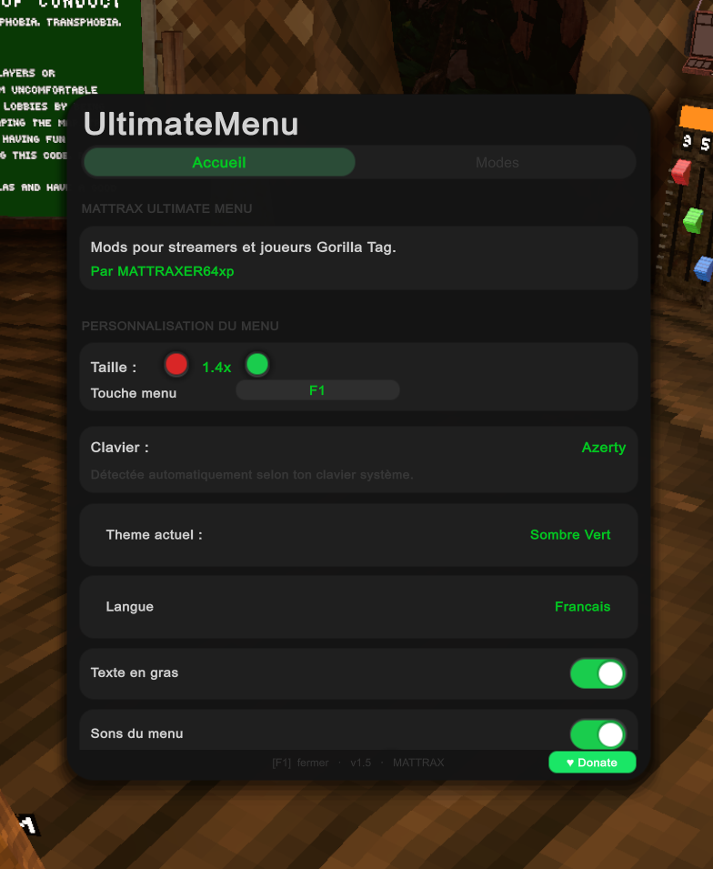

# UltimateMenu

**A mod menu for Gorilla Tag**

[Download](https://github.com/MATTRAX64/UltimateMenu/releases) · [Report Bug](https://github.com/MATTRAX64/UltimateMenu/issues) · [Request Feature](https://github.com/MATTRAX64/UltimateMenu/issues)

> Ce projet n'est pas affilié à Another Axiom ni à Gorilla Tag.

### - [Contacter moi](https://mattraxer64xp.page.gd) pour des idées Updates / Optimisations / problèmes ❇️

[📊 Voir les téléchargements](https://github.com/MATTRAX64/UltimateMenu/blob/main/scripts/downloads.json)
> téléchargeable sur Github✅, nexusmods✅, gamebanana ✅, Thunderstore✅, Excalibur Launcher✅, Patreon✅
### 250 Téléchargement en moins de 4 jour !

---

## 📋 Table des matières

- [Interface](#-interface)
- [Nouveautés V1.5](#-nouveautés-v15)
- [Liste des mods](#-liste-des-mods)
- [Mods annexes](#-mods-annexes)
- [🌐 Other languages](#-other-languages)

---

## 🖥 Interface

Le mod menu est organisé en 3 pages :

| Page | Description |
|:--|:--|
| 🏠 **Accueil** | Personnalisation de l'interface et réglages généraux |
| 🧩 **Mods** | Liste de tous les mods, active/désactive chacun individuellement |
| ⚙️ **Page de mod** | Accès aux paramètres spécifiques du mod sélectionné |

## 🆕 Nouveautés V1.5

- Nouvelle interface style **"Round"**
- Simplification des mods
- Import de tous les fichiers directement dans le dossier du mod
- Ajout de sons dans l'interface

## 🧩 Liste des mods

- 🎥 **GorillaCamera** — Contrôleur de caméra pour animations en boucle, durée personnalisable, modes Linéaire / Bézier
- 💬 **GorillaDiscord** — Affiche ton activité Discord
- 😮 **GorillaFaces** — Anime la bouche en fonction de la parole, image par image
- 🪞 **GorillaMiror** — Améliore la qualité du miroir dans City
- 🎬 **GorillaMocaps** — Enregistre les mouvements en jeu pour Blender (caméra incluse, compatible Blender 4/5)
- 🏷️ **GorillaNames** — Attribue un pseudo selon le skin, mise à jour au rejoin
- 🚪 **GorillaRooms** — Rejoins/favorise tes rooms, sélection aléatoire
- ✨ **GorillaShaders** — Shader visuel simple
- 📦 **GorillaSpawners** — Fait apparaître des objets 3D, visible en local uniquement
- 📡 **GorillaStreams** — Affiche code/joueurs pour le stream, exportable en texte
- 🕺 **GorillaTrackings** — Body tracking avancé (vitesse, style, tracker réel)
- 🔊 **GorillaVoices** — Chat vocal privé avec tes amis
- 🌧️ **GorillaWeather** — Change la météo

## 🔧 Mods annexes

- **GorillaVoices Patch**
- **GorillaInterface** — gère les mods en jeu
- **GorillaNameTags** — affiche le pseudo et la plateforme des joueurs

---

## 🌐 Other languages

<b>🇬🇧 English</b>

 

**Interface:** 🏠 Home (customization & settings) · 🧩 Mods (toggle individually) · ⚙️ Mod page (specific settings)

**What's new in V1.5:** New "Round" style interface · Simplified mods · Import files directly into the mod folder · Added sounds

**Mod list:** same as above — GorillaCamera, GorillaDiscord, GorillaFaces, GorillaMiror, GorillaMocaps, GorillaNames, GorillaRooms, GorillaShaders, GorillaSpawners, GorillaStreams, GorillaTrackings, GorillaVoices, GorillaWeather (see French section above for full descriptions — mod names and behavior are identical across languages)

**Additional mods:** GorillaVoices Patch · GorillaInterface · GorillaNameTags

<b>🇪🇸 Español</b>

 

**Interfaz:** 🏠 Inicio (personalización y ajustes) · 🧩 Mods (activar/desactivar) · ⚙️ Página del mod (ajustes específicos)

**Novedades V1.5:** Nueva interfaz "Round" · Mods simplificados · Importar archivos directo a la carpeta del mod · Sonidos añadidos

**Lista de mods:** igual que arriba — ver la sección en francés para las descripciones completas (los mods son idénticos en todos los idiomas)

**Mods adicionales:** GorillaVoices Patch · GorillaInterface · GorillaNameTags

<b>🇩🇪 Deutsch</b>

 

**Interface:** 🏠 Startseite (Anpassung & Einstellungen) · 🧩 Mods (einzeln aktivieren) · ⚙️ Mod-Seite (spezifische Einstellungen)

**Neuerungen V1.5:** Neue "Round"-Oberfläche · Vereinfachte Mods · Dateien direkt in den Mod-Ordner importieren · Sounds hinzugefügt

**Mod-Liste:** wie oben — siehe den französischen Abschnitt für vollständige Beschreibungen (Mods sind in allen Sprachen identisch)

**Zusätzliche Mods:** GorillaVoices Patch · GorillaInterface · GorillaNameTags

<b>🇷🇺 Русский</b>

 

**Интерфейс:** 🏠 Главная (настройка и параметры) · 🧩 Моды (вкл/выкл по отдельности) · ⚙️ Страница мода (настройки)

**Новое в V1.5:** Новый интерфейс "Round" · Упрощённые моды · Импорт файлов прямо в папку мода · Добавлены звуки

**Список модов:** как выше — см. французский раздел для полных описаний (моды одинаковы на всех языках)

**Доп. моды:** GorillaVoices Patch · GorillaInterface · GorillaNameTags

<b>🇯🇵 日本語</b>

 

**インターフェース：** 🏠 ホーム（カスタマイズと設定）· 🧩 Mods（個別に切替）· ⚙️ Mod ページ（専用設定）

**V1.5 の新機能：** 新しい「Round」スタイル · mod の簡略化 · ファイルを mod フォルダに直接インポート · サウンド追加

**Mod 一覧：** 上記と同じ — 詳細な説明はフランス語セクションを参照（すべての言語で mod は同一）

**追加 mod：** GorillaVoices Patch · GorillaInterface · GorillaNameTags

---

Made with 🦍 for the Gorilla Tag community

