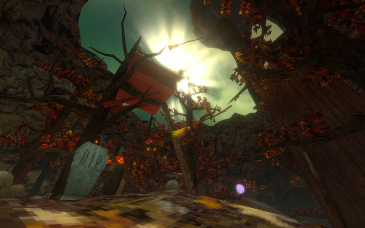
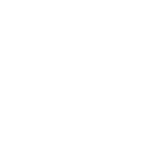

# UltimateMenu

**A Gorilla Tag mod menu with a Liquid Glass interface & Shaders**

**v1.8 series** · **18 languages**

 

  
  &nbsp;
  
  &nbsp;
  
  &nbsp;
  
  &nbsp;
  

[Download](https://github.com/MATTRAX64/UltimateMenu/releases) · [Report a bug](https://github.com/MATTRAX64/UltimateMenu/issues) · [Contact](https://mattraxer64xp.page.gd)

> **UltimateMenu is an independent community project. This project uses AI to help compress and optimize files before uploading them to GitHub.**

##  What's new in v1.8

The **Liquid Glass** interface uses URP post-processing to render glass effects in the menu.

##  Features

| | Feature | What you can do |
| :---: | :--- | :--- |
|  | **Visual effects** | Customize the look of the game with visual presets and post-processing. |
|  | **Character and camera** | Adjust character interactions and camera controls. |
|  | **Motion capture** | Export recordings and import them into Blender. |
|  | **Profiles** | Import and export settings and customize the menu’s appearance, language, and sound. |
|  | **Performance** | Adjust Unity performance settings. |
|  | **Discord Rich Presence** | Display your in-game activity on Discord. |

Each mod has its own settings.

##  Installation

1. Install [BepInEx for Gorilla Tag](https://github.com/MATTRAX64/GorillaTagModInstaller).
2. Download `UltimateMenu.dll` from [GitHub Releases](https://github.com/MATTRAX64/UltimateMenu/releases).
3. Place the DLL in your game’s `BepInEx\plugins` folder.
   - **Steam** — `C:\Program Files (x86)\Steam\steamapps\common\Gorilla Tag\BepInEx\plugins`
   - **Meta PC (Oculus)** — `C:\Program Files\Oculus\Software\Software\another-axiom-gorilla-tag\BepInEx\plugins`
4. Launch Gorilla Tag.

##  Usage

A **required tutorial** shows you how to open the menu in VR. On desktop, the menu hotkey appears when the mod loads.

### Blender and 3D objects

- **Mocap** — Install the [GorillaMocap Blender add-on](UltimateMenu/Assets/GorillaMocap/GorillaMocap-BlenderAsset.zip), then open it from the 3D Viewport or press **N** to find it in the sidebar.
- **3D objects** — Use [AutoBundle.unitypackage](UltimateMenu/Assets/GorillaSpawners/AutoBundle.unitypackage) to create your own bundles with the Unity version used by Gorilla Tag. You can also browse the [community objects](GorillaSpawners_3D_Objects/).

##  Files and folders

UltimateMenu stores its data under `BepInEx/plugins/UltimateMenu/`.

| File or folder | Contents |
| :--- | :--- |
| `Profile.json` | Menu settings |
| `GorillaFaces/` | Custom face images |
| `GorillaMocap/` | Mocap exports for Blender |
| `GorillaSpawners/` | 3D object `.bundle` files |
| `GorillaStreams/` | Text for OBS, including the room code and player count |
| `CrashReports/` | Error reports when reporting is enabled |

## 🔐 Privacy

- **Error reporting** is enabled by default to help diagnose and fix issues. You can turn it off in the mod menu settings.
- **Update checks** use the GitHub API at startup.

## ⚠️ Warning

Using mods may result in a ban under the game’s rules. Use UltimateMenu responsibly and at your own risk.

---

**MATTRAX** · [Contact](https://mattraxer64xp.page.gd) · [Patreon](https://www.patreon.com/c/MATTRAXER64xp)

